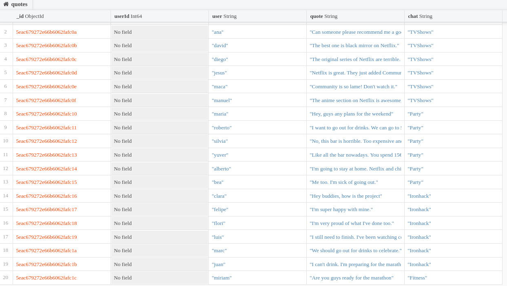

# Project | Chat Sentiment Analysis

## Introduction

In this project we will create an API to store chat messages and users in a Mongodb database. After we will analyze the sentiment of the chats as Positive, Negative or Neutral.  Finally, we will recommend the top three friends to a user based on the sentiment similarity. Please find below the details about the project. 

## Mongo.py

In this file, we have created an API in Flask. Please find the API endpoints below:

USER - Endpoints:

- Create users and save into the Mongodb database: Project-API.quotes
("/user/create/<username>")

CHAT - Endpoints:

- Create chats and save into the database: TVShows, Party, Ironhack, Fitness, Cooking.
("/chat/create/<chatname>")

- Add users into a chats. Six users per chat.
("/chat/<chatname>/adduser/<username>")

- Add a message to a chats. One per user. 
("/chat/<chatname>/user/<username>/addmessage/<message>")

MONGODB - Database:

## SentAnalysis.py

Here is the sentiment analysis of each chat.

- Get all the messages from a chat. 
("/chat/<chatname>/list")
   
- Analyze the sentiment of the messages on the chat
  Classify them into Mostly Positive or Mostly Negative and show the details, by using the NLTK sentiment analysis package.
  ("/chat/<chatname>/sentiment")
  
## Recommender.py

This section is for recommend the top three friends of a user based on the sentiment similarity.

- Recommending friends using a recommender system with NLP analysis.
("/user/<username>/recommend")

## Api.py

File with all the routes and the decorators to run the code.

## Pruebas-API

Jupyter notebook to test the functions and proof that they work. All the tests were sucessfull!

## Links

- [<https://www.nltk.org/]>
- [<https://towardsdatascience.com/basic-binary-sentiment-analysis-using-nltk-c94ba17ae386]>
- [<https://www.digitalocean.com/community/tutorials/how-to-perform-sentiment-analysis-in-python-3-using-the-natural-language-toolkit-nltk]>